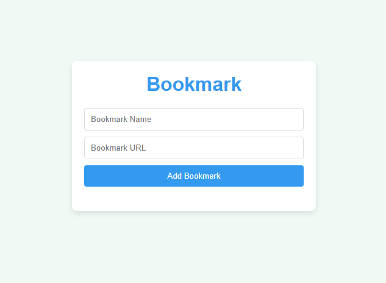

# 📑 Bookmark

A simple and elegant web app to save, view, and delete your favorite bookmarks. Built with **HTML**, **CSS**, and **JavaScript**. Bookmarks persist across sessions using `localStorage`.

## ✨ Features

- ✅ Add a bookmark with name + URL
- ✅ Open saved bookmarks in a new tab
- ✅ Delete bookmarks
- ✅ Data persists using `localStorage`
- ✅ Responsive, clean, mobile-friendly UI
- ✅ URL validation (requires `http://` or `https://`)

## 📸 Preview

 <!-- replace with actual screenshot if available -->

## 🚀 Getting Started

### 1. Clone the repo

```bash
git clone https://github.com/hcodes1/bookmark.git
cd bookmark
````

### 2. Open `index.html`

You can open `index.html` directly in your browser:

```bash
open index.html
# or
start index.html
```

No build or server required. It's 100% static.

## 🧠 How It Works

* JavaScript handles bookmark creation and deletion.
* Bookmarks are stored in `localStorage`, so they stay even after closing the browser.
* DOM is updated dynamically as bookmarks are added or removed.

## 📁 Project Structure

```bash
📂 bookmark
├── index.html          # Main HTML file
├── style.css           # CSS styling
├── script.js           # JavaScript logic
└── README.md           # Project documentation
```

## 📌 To-Do (Improvements)

* [ ] Prevent duplicate bookmark entries
* [ ] Add confirmation before delete
* [ ] Add tags or categories to bookmarks
* [ ] Import/export bookmark data as JSON
* [ ] Add favicon and title preview in UI

## 💡 Credits

Built with ❤️ using pure HTML, CSS, and JavaScript.

## 📜 License

This project is open-source and available under the [MIT License](LICENSE).
